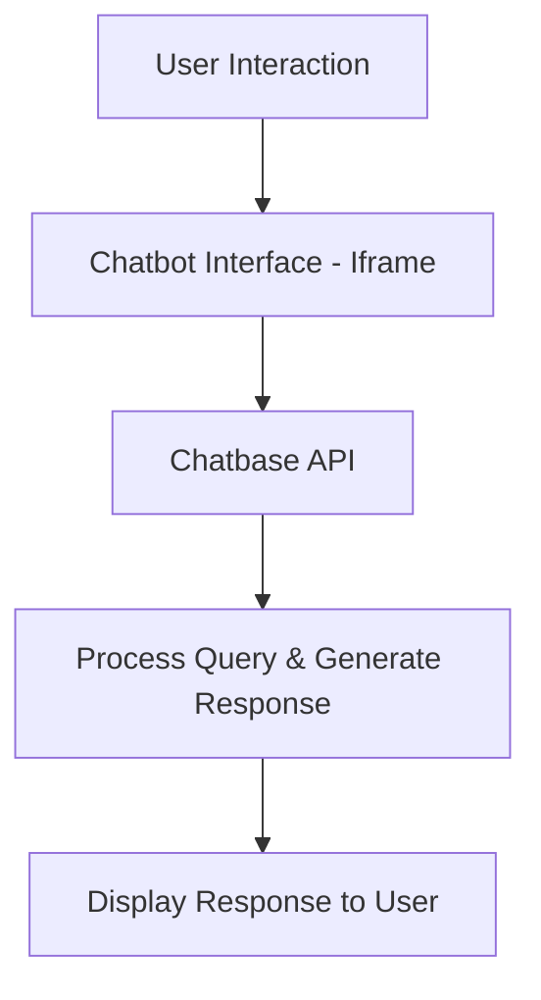
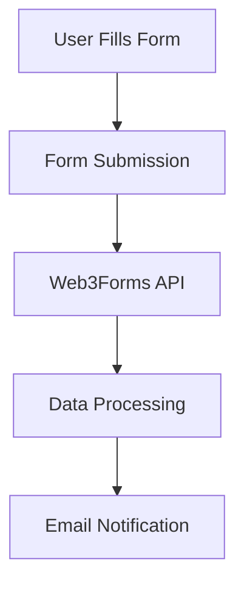

# MOM & CHILD - Maternal & Child Healthcare Platform 🚀

A comprehensive web application designed to provide maternal and child healthcare services with modern Firebase backend integration.

## 🌟 Features

### Frontend Features
- **Responsive Design**: Mobile-first approach with Bootstrap 5
- **Modern UI/UX**: Beautiful gradient designs with smooth animations
- **Interactive Components**: SweetAlert2 for enhanced user interactions
- **AI Chat Integration**: Embedded AI health assistant
- **Multi-language Support**: Ready for internationalization

### Backend Features (Firebase)
- **User Authentication**: Email/Password + Google OAuth
- **User Management**: Comprehensive user profiles
- **Data Storage**: Firestore for medical forms and user data
- **Real-time Updates**: Live authentication state management
- **Security**: Firestore security rules for data protection

### Healthcare Features
- **Health Topics**: Comprehensive maternal and child health information
- **Document Management**: Essential medical documents and forms
- **Emergency Services**: Quick access to emergency contacts
- **Global Presence**: Multi-country healthcare information
- **Medical Form Submission**: Secure form handling with Firebase integration

## 🚀 Quick Start

### Prerequisites
- Modern web browser
- Firebase account
- Basic knowledge of HTML/CSS/JavaScript

### Installation

1. **Clone/Download the project**
   ```bash
   git clone <your-repo-url>
   cd maternal-child-healthcare
   ```

2. **Set up Firebase** (Essential step)
   - Follow the detailed guide in `FIREBASE_SETUP.md`
   - Create a Firebase project
   - Enable Authentication and Firestore
   - Update `firebase-config.js` with your credentials

3. **Test the setup**
   - Open `firebase-test.html` in your browser
   - Run the automated tests to verify Firebase configuration

4. **Launch the application**
   - Open `index.html` in your browser
   - Or serve it using a local web server

## 📁 Project Structure

```
├── index.html              # Main landing page
├── login.html              # User login page
├── register.html           # User registration page
├── dashboard.html          # User dashboard (protected)
├── firebase-config.js      # Firebase configuration and functions
├── firebase-test.html      # Firebase connection testing page
├── FIREBASE_SETUP.md       # Detailed Firebase setup guide
└── README.md              # This file
```

## 🔧 Configuration

### Firebase Setup (Required)

1. **Create Firebase Project**
   - Go to [Firebase Console](https://console.firebase.google.com/)
   - Create a new project

2. **Enable Services**
   - Authentication (Email/Password + Google)
   - Firestore Database

3. **Update Configuration**
   Replace the placeholder config in `firebase-config.js`:
   ```javascript
   const firebaseConfig = {
       apiKey: "your-actual-api-key",
       authDomain: "your-project.firebaseapp.com",
       projectId: "your-project-id",
       storageBucket: "your-project.appspot.com",
       messagingSenderId: "123456789",
       appId: "your-app-id"
   };
   ```

## 🎯 Usage

### For Users
1. **Registration**: Create an account using email or Google
2. **Login**: Access your personalized dashboard
3. **Medical Forms**: Submit and track medical information
4. **AI Chat**: Get health guidance from the AI assistant
5. **Emergency Access**: Quick access to emergency services

### For Developers
1. **Authentication**: Uses Firebase Auth for secure user management
2. **Database**: Firestore for scalable data storage
3. **Forms**: Integrated form handling with validation
4. **Responsive**: Works on all devices and screen sizes

## 🔒 Security Features

- **Authentication Required**: Protected routes require login
- **Data Isolation**: Users can only access their own data
- **Input Validation**: Client and server-side validation
- **Secure Storage**: Firebase handles data encryption
- **Privacy Compliant**: GDPR-ready architecture

## 🎨 Customization

### Styling
- CSS variables for easy theme customization
- Bootstrap 5 for responsive layout
- Custom animations and transitions

### Content
- Easy to modify health topics and information
- Configurable emergency contact numbers
- Customizable AI chat integration

## 📱 Browser Support

- Chrome (recommended)
- Firefox
- Safari
- Edge
- Mobile browsers

## 🚦 Testing

### Automated Tests
Run `firebase-test.html` to verify:
- Firebase SDK loading
- Configuration validity
- Authentication service
- Firestore connectivity

### Manual Testing
1. User registration and login
2. Form submission and data storage
3. Dashboard functionality
4. Responsive design on mobile

## 🔧 Troubleshooting

### Common Issues

1. **Firebase not working**
   - Check configuration in `firebase-config.js`
   - Verify services are enabled in Firebase Console
   - Run `firebase-test.html` for diagnostics

2. **Authentication errors**
   - Ensure Email/Password provider is enabled
   - Check authorized domains in Firebase Console
   - Verify Google OAuth configuration

3. **Form submission issues**
   - Check Firestore security rules
   - Verify user authentication state
   - Check browser console for errors

### Getting Help
- Review `FIREBASE_SETUP.md` for detailed setup instructions
- Check browser console for error messages
- Verify Firebase Console for service status

## 🚀 Deployment

### Local Development
- Serve files using any local web server
- Test with `localhost` (add to Firebase authorized domains)

### Production Deployment
- Firebase Hosting (recommended)
- Any static hosting service (Netlify, Vercel, etc.)
- Update authorized domains in Firebase Console

## 📈 Future Enhancements

- [ ] Mobile app development
- [ ] Telemedicine integration
- [ ] Appointment scheduling system
- [ ] Medical record digitization
- [ ] Multi-language support
- [ ] Push notifications
- [ ] Offline functionality

## 🤝 Contributing

1. Fork the repository
2. Create a feature branch
3. Make your changes
4. Test thoroughly
5. Submit a pull request

## 📄 License

This project is licensed under the MIT License - see the LICENSE file for details.

## 🙏 Acknowledgments

- Bootstrap for responsive design
- Firebase for backend services
- SweetAlert2 for user interactions
- Font Awesome for icons
- Freepik for images

## 📞 Support

For technical support or questions:
- Review the documentation
- Check Firebase Console logs
- Test with `firebase-test.html`
- Contact the development team

---

**Made with ❤️ for maternal and child healthcare**  
- **AI Health Assistant**: A chatbot for instant health-related queries.  
- **Emergency Services**: Quick access to emergency helplines and protocols.  
- **Registration Form**: A seamless way to register for medical services.  

The platform is designed to be user-friendly, responsive, and accessible to everyone.  

---

## ✨ Features  
Here’s a breakdown of the key features:  

### 1. **Navigation Bar**  
- A responsive navbar with smooth hover effects and dropdowns for easy navigation.  
- Links to all major sections: About, Health Topics, Documents, Chat AI, Countries, and Emergency.  

### 2. **Hero Section**  
- A visually appealing hero section with a gradient background and a maternal health image.  
- Contains a catchy headline and a brief description of the platform's mission.  

### 3. **About Section**  
- Provides information about the platform's mission and vision.  
- Includes an image and a brief description of the services offered.  

### 4. **Health Topics Section**  
- Displays cards with information on maternal nutrition, infant care, and vaccinations.  
- Each card has an image, title, and brief description.  

### 5. **Documents Section**  
- Offers essential documents like birth certificates, vaccination records, and medical history.  
- Includes downloadable links to official resources.  

### 6. **Global Presence Section**  
- Highlights maternal health programs in different countries (USA, India, Nigeria, Australia).  
- Each country is represented with a card containing an image and description.  

### 7. **Chat with AI Section**  
- Integrates an AI-powered chatbot for instant health-related queries.  
- The chatbot is embedded using an iframe from **Chatbase**.  

### 8. **Emergency Section**  
- Provides emergency helpline numbers and protocols.  
- Includes buttons to call ambulance services, emergency care, and doctor consultations.  

### 9. **Registration Form**  
- A user-friendly form for medical registration.  
- Integrated with **Web3Forms** for backend processing.  

### 10. **Footer**  
- A simple footer with copyright information.  

---

## 🛠️ Technologies Used  
Here’s a list of technologies and tools used in this project:  

### Frontend  
- **HTML5**: For structuring the web pages.  
- **CSS3**: For styling and animations.  
- **Bootstrap 5**: For responsive design and pre-built components.  
- **JavaScript**: For interactivity and form validation.  
- **Font Awesome**: For icons.  

### Backend-as-a-Service (BaaS)  
- **Web3Forms**: For handling form submissions.  
- **Chatbase**: For integrating the AI chatbot.  

### APIs  
- **Chatbase API**: Powers the AI chatbot.  
- **Web3Forms API**: Handles the registration form submissions.  

### Hosting  
- Static hosting platforms like **GitHub Pages** or **Netlify** can be used to deploy the project.  

---

## 🌐 Backend-as-a-Service (BaaS) Platforms  

### 1. **Web3Forms**  
- Used for handling the medical registration form submissions.  
- Provides a simple way to collect form data without setting up a backend server.  
- Integrated using an API key and a hidden input field in the form.  

### 2. **Chatbase**  
- Powers the AI chatbot embedded in the platform.  
- The chatbot is integrated using an iframe, which connects to the Chatbase API.  

---

## 🔗 API Integration  

### 1. **Chatbase API**  
- The chatbot is embedded using an iframe.  
- The iframe source points to the Chatbase chatbot URL.  
- Users can interact with the chatbot directly on the platform.  

### 2. **Web3Forms API**  
- The registration form is integrated with Web3Forms.  
- The form data is sent to Web3Forms using a POST request.  
- Web3Forms processes the data and sends it to the specified email address.  

---

### 🌐 API Workflow Diagrams  

#### 1. **Chatbot API Workflow**  


**Explanation**:  
- **User Interaction**: The user types a query in the chatbot interface.  
- **Chatbot Interface (Iframe)**: The query is sent to the Chatbase API via an embedded iframe.  
- **Chatbase API**: Processes the query using AI and generates a response.  
- **Display Response**: The response is displayed back to the user in the chat interface.  

---

#### 2. **Registration Form API Workflow**  


**Explanation**:  
- **User Fills Form**: The user enters their details in the medical registration form.  
- **Form Submission**: The form data is submitted to the Web3Forms API.  
- **Web3Forms API**: Processes the data and sends it to the specified email address.  
- **Email Notification**: The admin receives an email with the user's registration details.  

---

## 🎯 How to Use  
1. **Navigation**: Use the navbar to explore different sections of the platform.  
2. **Chat with AI**: Click on the "Chat with AI" section to interact with the AI health assistant.  
3. **Emergency Services**: Use the emergency section to access helpline numbers and protocols.  
4. **Registration Form**: Fill out the form in the "Medical Registration" section to register for services.  
5. **Download Documents**: Access essential documents in the "Documents" section.  

---


## 🙏 Thank You!  
Thank you for exploring the **MOM & CHILD** project! We hope this platform contributes to a healthier future for mothers and children worldwide. If you have any questions or suggestions, feel free to reach out!  

--- 

🌟 **Let’s make maternal and child healthcare accessible to all!** 🌟
