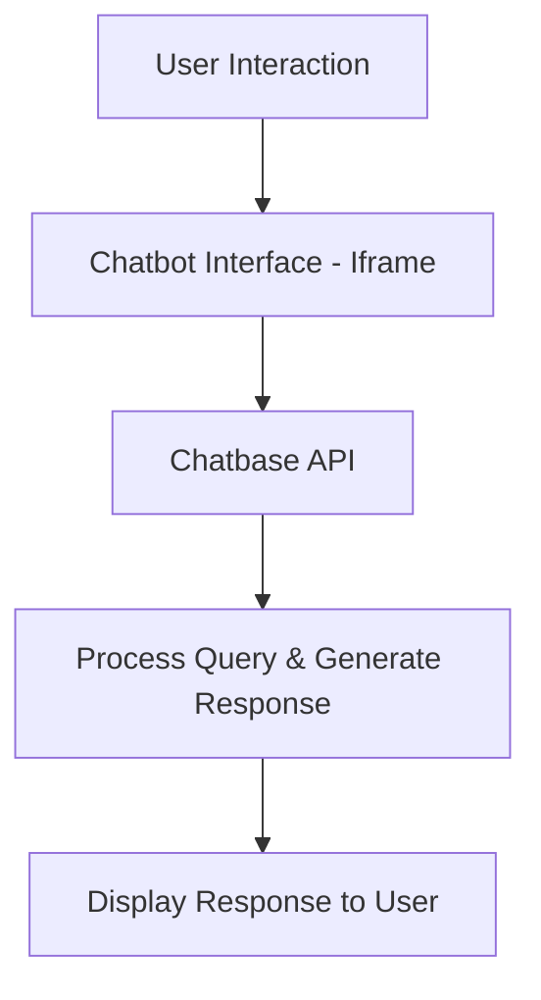
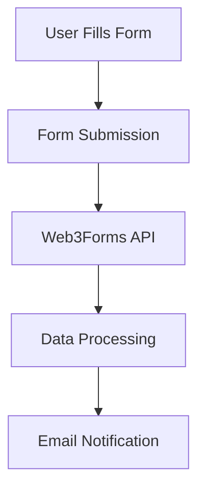

# 🌟 MOM & CHILD - Maternal & Child Health Platform 🌟  

Welcome to the **MOM & CHILD** project! This platform is designed to provide comprehensive maternal and child healthcare services, ensuring a healthier future for mothers and children worldwide. Below is a detailed explanation of the project, its features, technologies used, and how everything works together seamlessly.  

---

## 🚀 Project Overview  
The **MOM & CHILD** platform is a web-based application that focuses on maternal and child health. It provides:  
- **Health Education**: Information on maternal nutrition, infant care, and vaccinations.  
- **Essential Documents**: Access to birth certificates, vaccination records, and medical history.  
- **Global Presence**: Insights into maternal health programs across different countries.  
- **AI Health Assistant**: A chatbot for instant health-related queries.  
- **Emergency Services**: Quick access to emergency helplines and protocols.  
- **Registration Form**: A seamless way to register for medical services.  

The platform is designed to be user-friendly, responsive, and accessible to everyone.  

---

## ✨ Features  
Here’s a breakdown of the key features:  

### 1. **Navigation Bar**  
- A responsive navbar with smooth hover effects and dropdowns for easy navigation.  
- Links to all major sections: About, Health Topics, Documents, Chat AI, Countries, and Emergency.  

### 2. **Hero Section**  
- A visually appealing hero section with a gradient background and a maternal health image.  
- Contains a catchy headline and a brief description of the platform's mission.  

### 3. **About Section**  
- Provides information about the platform's mission and vision.  
- Includes an image and a brief description of the services offered.  

### 4. **Health Topics Section**  
- Displays cards with information on maternal nutrition, infant care, and vaccinations.  
- Each card has an image, title, and brief description.  

### 5. **Documents Section**  
- Offers essential documents like birth certificates, vaccination records, and medical history.  
- Includes downloadable links to official resources.  

### 6. **Global Presence Section**  
- Highlights maternal health programs in different countries (USA, India, Nigeria, Australia).  
- Each country is represented with a card containing an image and description.  

### 7. **Chat with AI Section**  
- Integrates an AI-powered chatbot for instant health-related queries.  
- The chatbot is embedded using an iframe from **Chatbase**.  

### 8. **Emergency Section**  
- Provides emergency helpline numbers and protocols.  
- Includes buttons to call ambulance services, emergency care, and doctor consultations.  

### 9. **Registration Form**  
- A user-friendly form for medical registration.  
- Integrated with **Web3Forms** for backend processing.  

### 10. **Footer**  
- A simple footer with copyright information.  

---

## 🛠️ Technologies Used  
Here’s a list of technologies and tools used in this project:  

### Frontend  
- **HTML5**: For structuring the web pages.  
- **CSS3**: For styling and animations.  
- **Bootstrap 5**: For responsive design and pre-built components.  
- **JavaScript**: For interactivity and form validation.  
- **Font Awesome**: For icons.  

### Backend-as-a-Service (BaaS)  
- **Web3Forms**: For handling form submissions.  
- **Chatbase**: For integrating the AI chatbot.  

### APIs  
- **Chatbase API**: Powers the AI chatbot.  
- **Web3Forms API**: Handles the registration form submissions.  

### Hosting  
- Static hosting platforms like **GitHub Pages** or **Netlify** can be used to deploy the project.  

---

## 🌐 Backend-as-a-Service (BaaS) Platforms  

### 1. **Web3Forms**  
- Used for handling the medical registration form submissions.  
- Provides a simple way to collect form data without setting up a backend server.  
- Integrated using an API key and a hidden input field in the form.  

### 2. **Chatbase**  
- Powers the AI chatbot embedded in the platform.  
- The chatbot is integrated using an iframe, which connects to the Chatbase API.  

---

## 🔗 API Integration  

### 1. **Chatbase API**  
- The chatbot is embedded using an iframe.  
- The iframe source points to the Chatbase chatbot URL.  
- Users can interact with the chatbot directly on the platform.  

### 2. **Web3Forms API**  
- The registration form is integrated with Web3Forms.  
- The form data is sent to Web3Forms using a POST request.  
- Web3Forms processes the data and sends it to the specified email address.  

---

### 🌐 API Workflow Diagrams  

#### 1. **Chatbot API Workflow**  

**Explanation**:  
- **User Interaction**: The user types a query in the chatbot interface.  
- **Chatbot Interface (Iframe)**: The query is sent to the Chatbase API via an embedded iframe.  
- **Chatbase API**: Processes the query using AI and generates a response.  
- **Display Response**: The response is displayed back to the user in the chat interface.  

---

#### 2. **Registration Form API Workflow**  

**Explanation**:  
- **User Fills Form**: The user enters their details in the medical registration form.  
- **Form Submission**: The form data is submitted to the Web3Forms API.  
- **Web3Forms API**: Processes the data and sends it to the specified email address.  
- **Email Notification**: The admin receives an email with the user's registration details.  

---

## 🎯 How to Use  
1. **Navigation**: Use the navbar to explore different sections of the platform.  
2. **Chat with AI**: Click on the "Chat with AI" section to interact with the AI health assistant.  
3. **Emergency Services**: Use the emergency section to access helpline numbers and protocols.  
4. **Registration Form**: Fill out the form in the "Medical Registration" section to register for services.  
5. **Download Documents**: Access essential documents in the "Documents" section.  

---

## 🙏 Thank You!  
Thank you for exploring the **MOM & CHILD** project! We hope this platform contributes to a healthier future for mothers and children worldwide. If you have any questions or suggestions, feel free to reach out!  

--- 

🌟 **Let’s make maternal and child healthcare accessible to all!** 🌟
